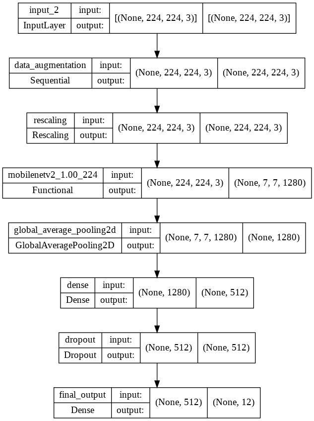

# MachineLearning-BestiApp

## Table of Content

1. [Introduction](#introduction)
2. [Member](#member)
3. [Datasets](#datasets)
4. [Model Architecture](#model-architecture)
5. [Other](#other)

### Introduction

This repository hold our Machine Learning model and Toolkits for helping us. our model about Image Classification with Multi-Classes (12 Class).

### Member

|             **Name**             | **Bangkit ID** |           **Github Probile**            |    **Job Desk**    |
| :------------------------------: | :------------: | :-------------------------------------: | :----------------: |
|          Hana Machmudah          |   M2004F0308   | [Link](https://github.com/hanamach0703) | Preprocessing Data |
| Gusti Muhammad Aulia Nur Sulthan |   M2247K2175   |    [Link](https://github.com/tnnz20)    |    Create Model    |

### Datasets

We use dataset from [Kaggle](https://www.kaggle.com/), This dataset has 15,150 images from 12 different classes of household garbage; paper, cardboard, biological, metal, plastic, green-glass, brown-glass, white-glass, clothes, shoes, batteries, and trash.

Download Original Dataset [Link](https://www.kaggle.com/datasets/mostafaabla/garbage-classification/)

> Class Distribution

| **No** | **Classification** | **Files** |
| :----: | :----------------: | :-------: |
|   1    |      clothes       |   5325    |
|   2    |     cardboard      |    891    |
|   3    |    green-glass     |    629    |
|   4    |       shoes        |   1977    |
|   5    |       metal        |    769    |
|   6    |     biological     |    985    |
|   7    |      plastic       |    865    |
|   8    |    brown-glass     |    607    |
|   9    |       trash        |    697    |
|   10   |      battery       |    945    |
|   11   |       paper        |   1050    |
|   12   |    white-glass     |    775    |
|        |       Total        |   15150   |

#### Preprocessing Datasets

Original Dataset has Imbalance Distribution it will make model to become `bias`, so we decided to Down Sampling our data.

Preprocessing Dataset [Link](https://drive.google.com/uc?id=1Sm4gAurI9er46i3MqQ5K9_0tPIIbmHSH)

> Class Distribution

| **No** | **Classification** | **Files** |
| :----: | :----------------: | :-------: |
|   1    |      battery       |    642    |
|   2    |     biological     |    648    |
|   3    |    brown-glass     |    607    |
|   4    |    green-glass     |    629    |
|   5    |    white-glass     |    645    |
|   6    |     cardboard      |    643    |
|   7    |       metal        |    649    |
|   8    |      plastic       |    645    |
|   9    |       trash        |    649    |
|   10   |      clothes       |    645    |
|   11   |       paper        |    645    |
|   12   |       shoes        |    647    |
|        |       Total        |   7692    |

### Model Architecture

Our model was created full using [Tensorflow](https://www.tensorflow.org/). The base model from the [MobileNetV2](https://www.tensorflow.org/api_docs/python/tf/keras/applications/mobilenet_v2/MobileNetV2) .

### Other

See our Notebook [Here](https://github.com/Besti-Corps/MachineLearning-BestiApp/blob/main/Model/model_image_classification.ipynb)

Test Model [Here](https://github.com/Besti-Corps/MachineLearning-BestiApp/blob/main/Model/testing_model.ipynb)

Toolkits [Here](https://github.com/Besti-Corps/MachineLearning-BestiApp/tree/main/Toolkits)

#### Tool Version

- Python version: 3.8
- Tensorflow version: 2.8
